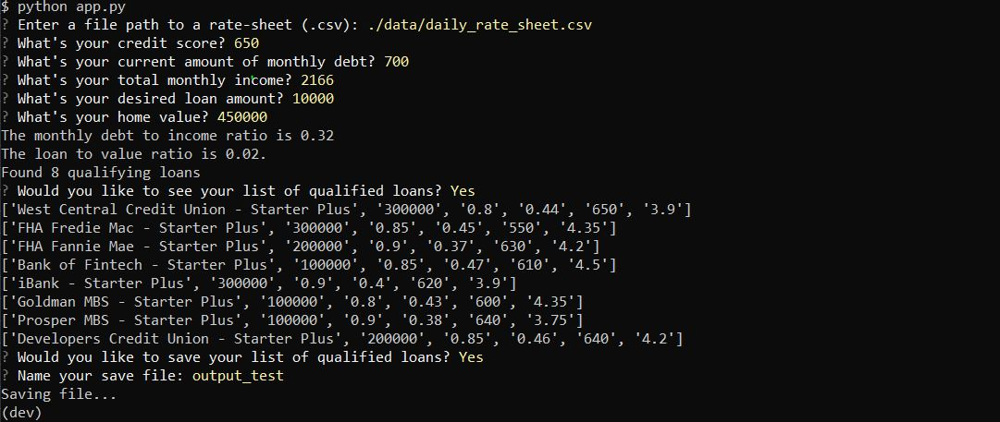

# Loan Qualifier Application

>"To asses the eligibility of users for a given csv file of loans"

---
## Directory
[Main Code](Starter_Code/qualifier/app.py)

[Utility](Starter_Code/qualifier/utils)

[Filters](Starter_Code/qualifier/filters)

[Data](Starter_Code/qualifier/data)

[Tests](Starter_Code/qualifier/tests/test_qualifier.py)

---
**Welcome to my repository for one of my first major FinTech projects.
This is a loan qualifier application that will match users with eligible loans.
Users will enter their financial information and they will receive a list of qualifying loans**

---
### Dependancies: Fire and Questionary
**To succesfully run this code you will need to execute the following commands in your terminal:**

**pip install fire**

**pip install questionary**

---
**Below is a screen shot of the application running**

**You have the option to print your qualifying looans before you save them as well**

